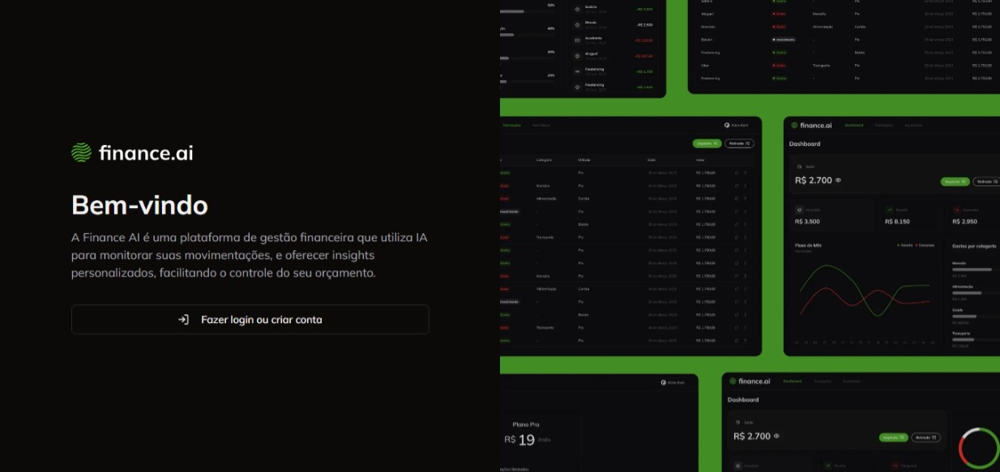
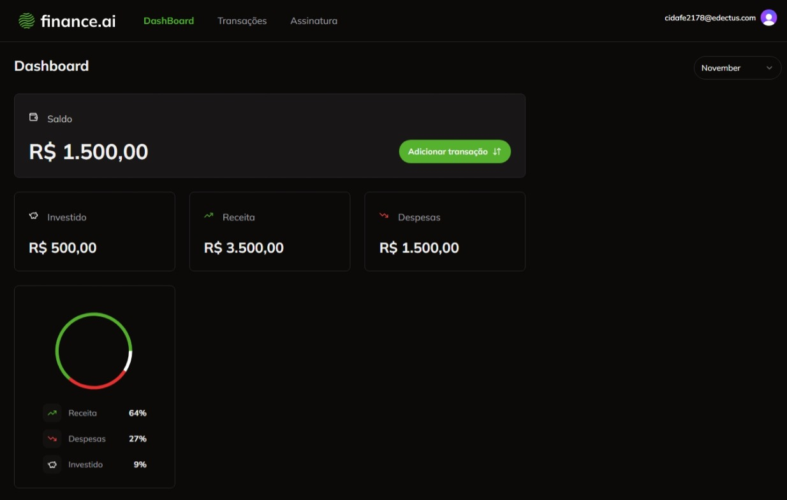
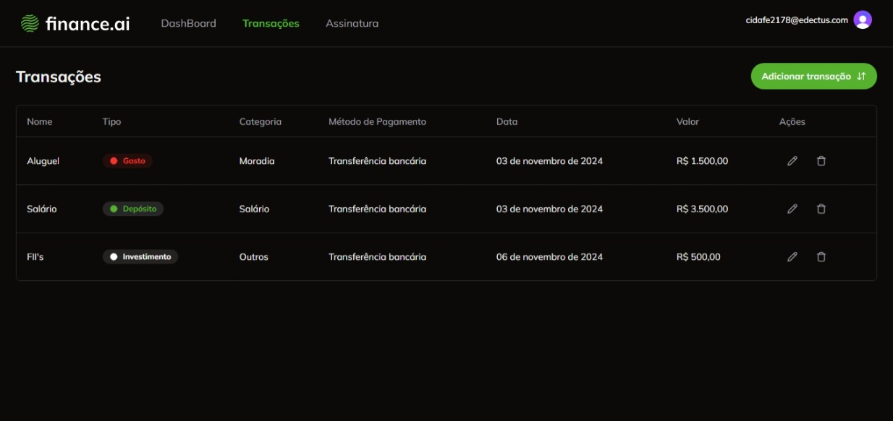
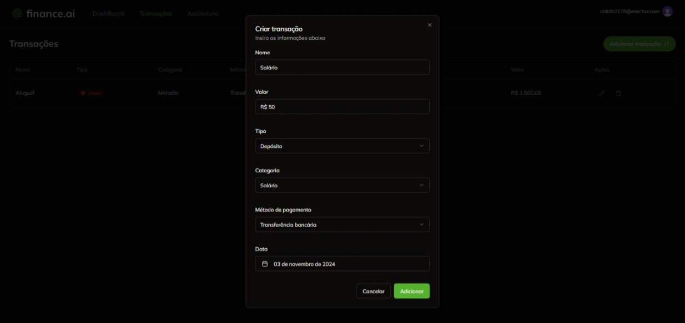

## 💸 Finance AI | Projeto para controle de finanças

 é uma aplicação desenvolvida para auxiliar no controle de finanças pessoais, oferecendo funcionalidades para gerenciar transações, visualizar relatórios e obter insights financeiros de forma prática e intuitiva.

  

### ✅ Visão Geral do Projeto

Muitas pessoas enfrentam dificuldades em gerenciar suas finanças pessoais de maneira eficaz. A falta de visibilidade sobre gastos e receitas pode levar a problemas financeiros, como dívidas acumuladas e falta de poupança. O projeto FinanceAI surge como uma solução para essas questões, proporcionando uma ferramenta que ajuda os usuários a controlar suas finanças, oferecendo insights valiosos e permitindo decisões financeiras mais informadas e seguras.

### 🔗 Features

- [x] Conexão com Banco de Dados
- [x] Autenticação e gerenciamento de usuários com clerk & Google auth
- [x] Autenticação via e-mail e senha
- [x] Gereciamento de transações
- [x] Suporte a múltiplos usuários
- [x] Vizualização de dados aprimorada com gráficos (ShadcnUI)
- [ ] Integração com IA
- [ ] Implementação de planos e assinatura com stripe
- [ ] Deploy

### 💻 Screens

<table align="center">
  <tr>
    <td align="center">Login</td>
    <td align="center">Dashboard</td>
  </tr>
  <tr>
    <td></td>
    <td></td>
  </tr>
  <tr>
    <td align="center">Transações</td>
    <td align="center">Adicionar Transação</td>
  </tr>
  <tr>
    <td></td>
    <td></td>
  </tr>
</table>

### Tecnologias Utilizadas

  <ul>
    <li></li>
    <li></li>
    <li></li>
    <li></li>
    <li></li>
    <li></li>
    <li></li>
    <li></li>
    <li></li>
  </ul>

